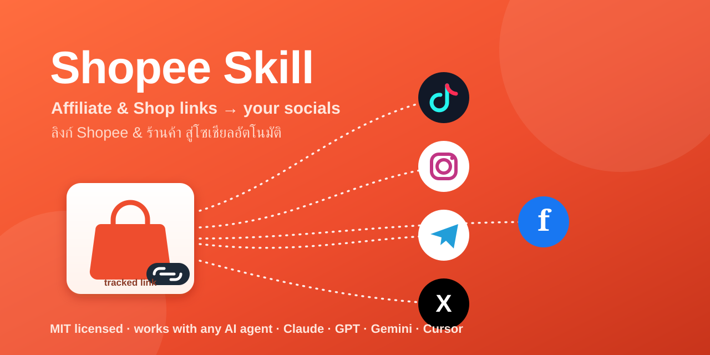

<p align="center">
  
</p>

<h1 align="center">Shopee Skill</h1>

<p align="center">
  <a href="LICENSE"></a>
  
  
</p>

<p align="center"><b>EN</b> · Connect a Shopee <b>Affiliate</b> or <b>Shop (Seller)</b> account and run the whole promote-a-product workflow — generate tracked links, compose bilingual social captions, queue tasks, and auto-post to TikTok, Instagram/Facebook, X, and Telegram.<br>
<b>ไทย</b> · เชื่อมต่อบัญชี Shopee <b>Affiliate</b> หรือ <b>ร้านค้า (Seller)</b> เพื่อทำงานครบวงจร — สร้างลิงก์ติดตามผล เขียนแคปชันโซเชียลสองภาษา จัดคิวงาน และโพสต์อัตโนมัติไปยัง TikTok, Instagram/Facebook, X และ Telegram</p>

---

## English

### What it is
A **model-agnostic skill**: plain Python 3 CLIs (standard library only — no `pip install`) that any AI agent or human can drive. For Claude Code it loads as a skill via [`SKILL.md`](SKILL.md); any other agent should read [`AGENTS.md`](AGENTS.md).

### Features
- 🔗 **Tracked links** — Shopee Affiliate short links & shop item links
- ✍️ **Bilingual captions** — Thai + English, tuned per platform
- 🗂️ **Task/campaign queue** — create, schedule, and track posts
- 🚀 **Auto-post** — TikTok, Instagram, Facebook, X, Telegram (WhatsApp stub)
- ⏰ **Cron mode** — `tasks.py due` emits JSON of due tasks for schedulers
- 🔒 **Safe by design** — dry-run by default; you confirm before any live post; keys never typed into web forms

### Quick start
```bash
# 1. install as a skill (Claude Code) or just clone anywhere
git clone https://github.com/bridgemekong/shopee-skill.git

# 2. add your API keys (only the sections you need)
mkdir -p ~/.shopee-skill
cp assets/credentials.example.json ~/.shopee-skill/credentials.json
chmod 600 ~/.shopee-skill/credentials.json
python3 scripts/config.py --check

# 3. run the workflow
python3 scripts/shopee_affiliate.py link --url "<shopee url>" --sub-id camp1
python3 scripts/tasks.py add --product "Earbuds" --link "<link>" --platforms telegram,x
python3 scripts/compose.py set --task 1 --platform x --caption "หูฟังคุ้มมาก 🎧 ...\nBest budget earbuds → <link> #ShopeeFinds"
python3 scripts/post.py --task 1 --platform x            # dry-run preview
python3 scripts/post.py --task 1 --platform x --live     # publish after you confirm
```

### Scheduling (cron)
```bash
python3 scripts/tasks.py due     # JSON of due tasks; exit 0 if any, exit 3 if none
```

### Getting API keys & approvals
See [`references/credentials-setup.md`](references/credentials-setup.md). Note that Shopee Affiliate Open API access, Shopee Open Platform, and posting on socials for others generally require developer accounts and app review. **Telegram and X** are the fastest to get live.

### Security
`credentials.json` and `tasks.json` live outside the repo (in `~/.shopee-skill/`) and are git-ignored. The agent never enters your passwords into any website — you obtain API keys yourself from each developer console.

---

## ไทย (Thai)

### นี่คืออะไร
**สกิลที่ใช้ได้กับ AI ทุกโมเดล** — เป็นสคริปต์ Python 3 ล้วน (ใช้ไลบรารีมาตรฐาน ไม่ต้อง `pip install`) ที่ AI agent หรือคนก็สั่งงานได้ สำหรับ Claude Code จะโหลดเป็นสกิลผ่าน [`SKILL.md`](SKILL.md) ส่วน agent อื่นให้อ่าน [`AGENTS.md`](AGENTS.md)

### ความสามารถ
- 🔗 **ลิงก์ติดตามผล** — ลิงก์สั้น Shopee Affiliate และลิงก์สินค้าของร้าน
- ✍️ **แคปชันสองภาษา** — ไทย + อังกฤษ ปรับตามแต่ละแพลตฟอร์ม
- 🗂️ **คิวงาน/แคมเปญ** — สร้าง ตั้งเวลา และติดตามการโพสต์
- 🚀 **โพสต์อัตโนมัติ** — TikTok, Instagram, Facebook, X, Telegram (WhatsApp เป็นโครงร่าง)
- ⏰ **โหมด Cron** — `tasks.py due` ส่งออกงานที่ถึงกำหนดเป็น JSON
- 🔒 **ปลอดภัยตั้งแต่ออกแบบ** — พรีวิวก่อนเสมอ ยืนยันก่อนโพสต์จริง ไม่กรอกรหัสผ่านลงเว็บ

### เริ่มใช้งาน
```bash
mkdir -p ~/.shopee-skill
cp assets/credentials.example.json ~/.shopee-skill/credentials.json
chmod 600 ~/.shopee-skill/credentials.json
python3 scripts/config.py --check    # ตรวจว่าตั้งค่าคีย์อะไรแล้วบ้าง
```
จากนั้นทำตามขั้นตอน: สร้างลิงก์ → เพิ่มงาน → เขียนแคปชัน → พรีวิว → โพสต์จริง (ดูตัวอย่างในหัวข้อ English ด้านบน)

### คีย์ API และการขออนุมัติ
ดู [`references/credentials-setup.md`](references/credentials-setup.md) — โดยทั่วไป Shopee Affiliate Open API, Shopee Open Platform และการโพสต์แทนผู้อื่นบนโซเชียลต้องมีบัญชีนักพัฒนาและผ่านการรีวิวแอป **Telegram และ X** ตั้งค่าให้ใช้งานจริงได้เร็วที่สุด

---

## Repo layout
```
SKILL.md                  entry point for Claude
AGENTS.md                 entry point for any other AI agent / human
references/               Shopee + social API docs, credential setup
scripts/                  Python CLIs (config, affiliate, shop, compose, tasks, post)
assets/                   banner + example config/task files
LICENSE                   MIT
```

## License
[MIT](LICENSE) © 2026 Bridge Mekong
